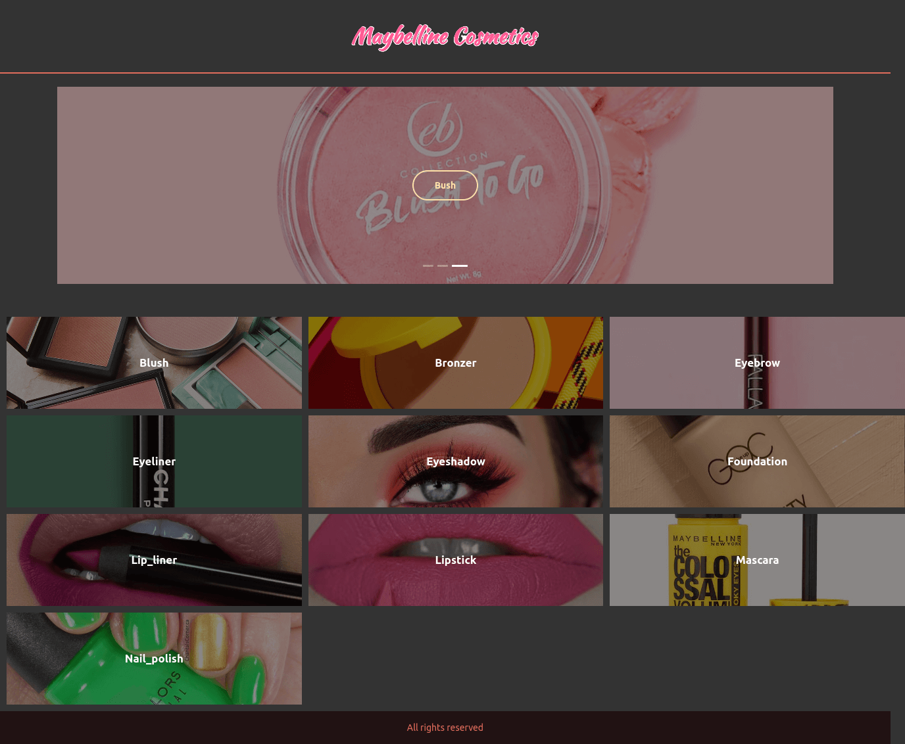

# makeup-challenge

In this project i made the frontend with react for a cosmetic store. This was with educational purpose. It is a good practice for web components, sass modules and responsive design.

[Click here to see a live demo](https://compassionate-khorana-2fc7e4.netlify.app/)
And take a look to the [wireframe made with figma](https://www.notion.so/Documentation-5a193ff126cc49c1b926584c7529bbf0#758f3e47c1814357bfd0ef6b3fb8611c)

To run this project just download or clone it and install packages with:

    npm i

Then use `npm run start` to serve the content.

You can find full documentation and production demo here:
[Documentation](https://www.notion.so/Makeup-Challenge-7271dd1cdb764efdba06c5de13c1ddd8)
